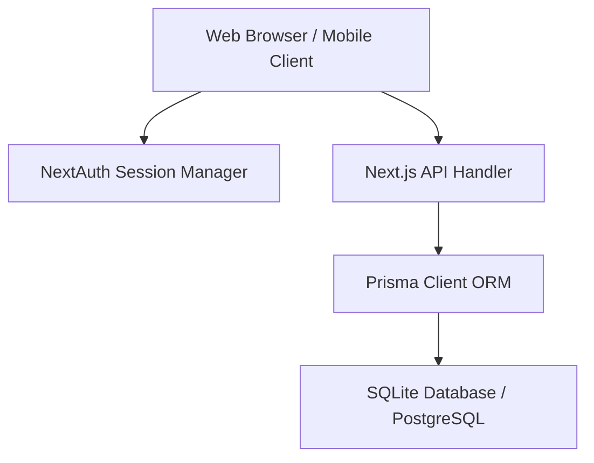

# SaaS Marketplace Architecture & Database Documentation

This document describes the design, entity structures, and dynamic RBAC sidebar layout of the Enterprise SaaS Marketplace application.

---

## 1. System Architecture

The application uses **Next.js 16 (App Router)** with a unified React Frontend and REST API Backend. Data access is facilitated by **Prisma ORM** connecting to a local **SQLite** database (configured for simple conversion to **PostgreSQL**).

---

## 2. Database Models (Storefront & Multi-Tenancy)

We extended the schema with two crucial SaaS multi-tenant entities: `Application` and `Shop`.

### Application Model
Represents a sub-tenant instance (e.g. Grocery App, Electronics App, pharmacy).
- `id` (CUID, primary key)
- `name` (String)
- `logo` (String, default icon path)
- `description` (String, optional)
- `settings` (JSON String)

### Shop Model
Represents individual shop outlets registered inside a specific Application.
- `id` (CUID, primary key)
- `name` (String)
- `logo` (String)
- `description` (String, optional)
- `status` (String, default ACTIVE)
- `applicationId` (CUID, foreign key to Application)

### User Model Extensions
- `shopId` (CUID, foreign key to Shop) - Associates a merchant user to their shop.
- `applicationId` (CUID, foreign key to Application) - Scopes the user context.

---

## 3. Dynamic RBAC Navigation & Access Control

Sidebar navigation options are filtered using two layers of protection:
1. **Role Access Check**: Menu items define `allowedRoles: ["DEVELOPER", "SUPER_ADMIN", "PRODUCT_ADMIN", "USER"]`. If the user's role is not included, the item is removed.
2. **Access Rights Checklist**: Granular permissions (stored in the User's `department` column as comma-separated values) match specific features (e.g., `inventory`, `orders`, `users`). If a user has the parent role but lacks the granular item permission, the navigation button is hidden completely.
